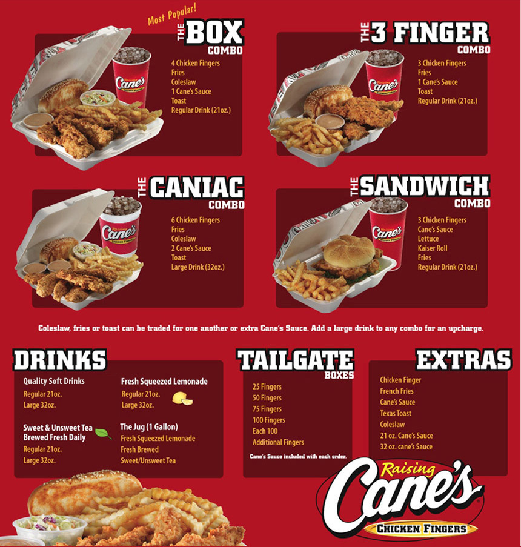

## Canes
### History of Canes

Established August 28, 1996. Founded by Todd Graves and Craig Silvey in Baton Rouge, Louisiana. In 1996, Todd Graves and Craig Silvey embarked on an ambitious journey to introduce a fresh and unique dining experience to the world. The story began when Todd and Craig, both Louisiana State University students, shared a dream of opening a restaurant that would serve one thing and do it exceptionally well – chicken fingers. Todd and Craig faced numerous challenges as they worked tirelessly to turn their vision into reality. They scraped together every penny they had, even taking out a loan and using Todd's car as collateral to secure funding. Their determination and unwavering belief in their concept propelled them forward. In 1996, the first Raising Canes restaurant opened its doors in Baton Rouge, Louisiana. The restaurant was named after Todd's beloved yellow Labrador Retriever, Raising Cane, who accompanied Todd on his entrepreneurial journey. The simplicity of the menu – chicken fingers, crinkle-cut fries, Texas toast, coleslaw, and a special Cane's sauce – was the key to its early success. Raising Canes quickly gained a devoted following due to its dedication to quality and customer satisfaction. As the brand grew in popularity, Todd and Craig began expanding their reach, opening new locations throughout Louisiana. The combination of delicious food and excellent service became synonymous with the Raising Canes experience. The journey was not without its hurdles. Todd and Craig faced financial difficulties and setbacks, but their determination never wavered. They remained steadfast in their commitment to their core values of quality, simplicity, and the love for chicken fingers. Raising Canes' popularity continued to soar, attracting attention from investors and franchisees eager to be part of the success story. By the early 2000s, Raising Canes had expanded beyond Louisiana and gained a nationwide presence. One of the defining features of Raising Canes is its commitment to giving back to the communities it serves. The company actively engages in philanthropic efforts, supporting education, pet welfare, and other charitable causes. As of my last knowledge update in September 2021, Raising Canes had over 500 locations across the United States and was showing no signs of slowing down. The brand's dedication to its original vision and unwavering commitment to quality continued to drive its success.

### Raising Canes 
#### Rasing Canes Link
[Raising Cane's Website](https://www.raisingcanes.com/home)
#### Raising Canes Menu

### Citations
#### [Figure 1 Yelp.com](https://www.yelp.com/biz/raising-cane-s-chicken-fingers-lakewood?osq=Raising+Canes)
####[Figure 2 EatDrinkSETX](https://www.eatdrinksetx.com/raising-canes-delicious-chicken-fingers-for-beaumont-port-arthur/)
